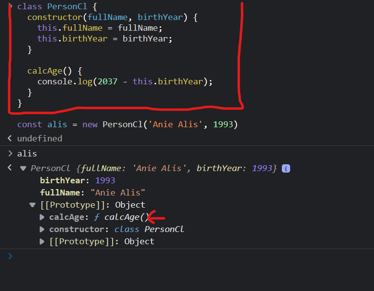
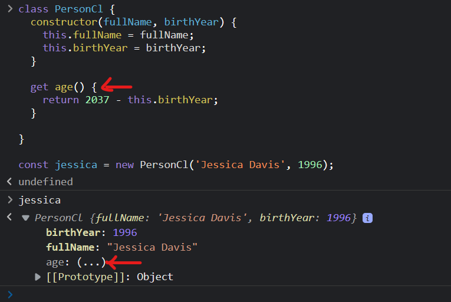
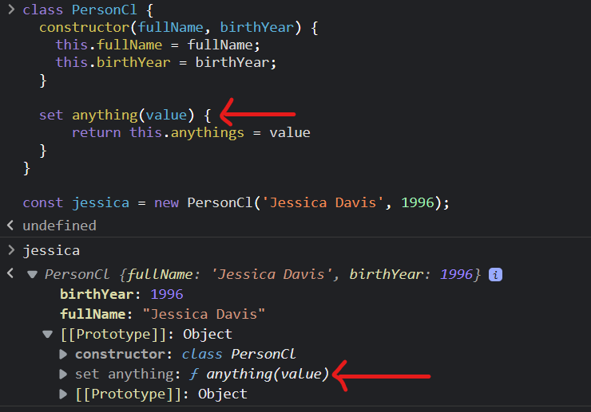
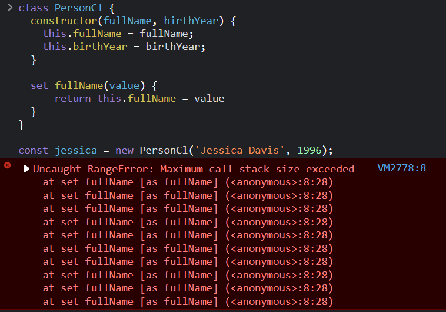
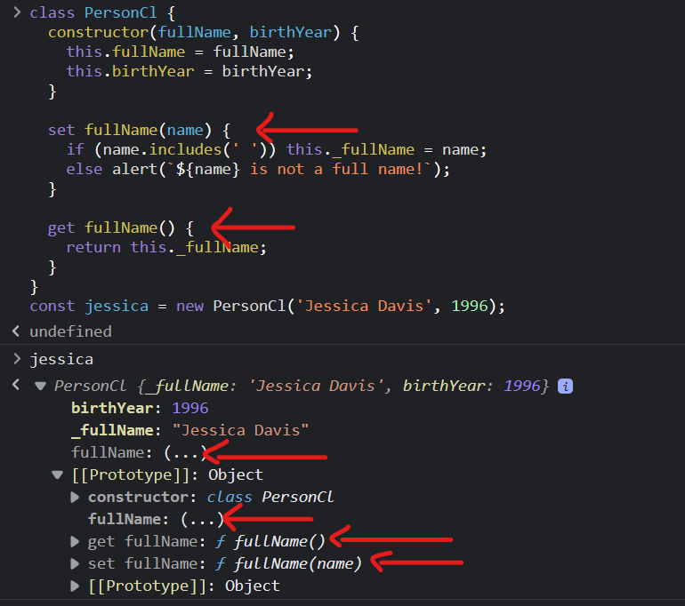
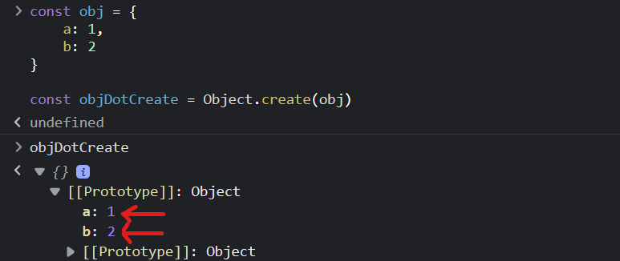
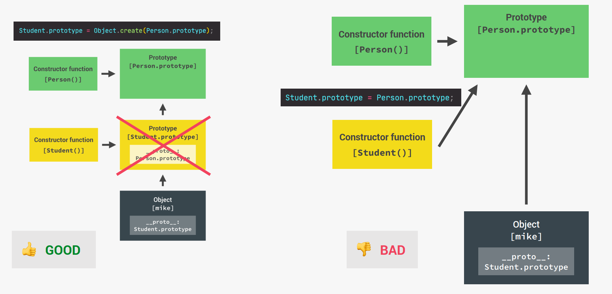

# Typescript-Summary

## Ref:
-[Jonas course]

(1) : https://github.com/jonasschmedtmann/complete-javascript-course/blob/master/14-OOP/final/script.js

(2) : https://www.udemy.com/course/the-complete-javascript-course/

-[TypeScript Tutorial]: https://www.typescripttutorial.net/

## OOP in Javascript

### 1. `Constructor Functions` and `new` Operator

---

**What happens after we execute the following code:**

```javascript
const Person = function (firstName, birthYear) {
  this.firstName = firstName;
  this.birthYear = birthYear;

  //Never to this! Because whenever create a new Person -> method of instance
  this.calcAge = function () {
    console.log(2037 - this.birthYear);
  };
};
//Should be:
Person.calcAge = function () {
  console.log(2037 - this.birthYear);
};
const vanhien = new Person("TVH", 1998);
```

```
1. New {} is created
2. function is called, this = {}
3. {} linked to prototype
4. function automatically return {}
```

---

### 2. `Prototype` && `__proto__`

---

(1) CF.`prototype` === instanceof.`__proto__`

(2) CF.`prototype`.`constructor` === CF

(3) instanceof.`__proto__`.`__proto__` === CF.`__proto__`

(4) instanceof.`__proto__`.`__proto__` === Object.`prototype` (top of prototype chain)

(4) instanceof.`__proto__`.`__proto__`.`__proto__` === null

(5) Array.`__proto__`.`__proto__`.`__proto__` === null

(6) Function`__proto__`.`__proto__`.`__proto__` === null

> > > > > > > > > > 

---

### 3. `Prototypal Inheritance` on Built-In Objects

```javascript
Array.prototype.unique = function () {
  return [...new Set(this)];
};

[1, 1, 3].unique(); // [1,3], Because [1,1,3] is instance of Array.
```

> > > > > > > > > > 

### 4. `ES6 Class`

---

ES6 Class is `Syntactic Sugar` and work **exactly** like constructor functions.
There are a few points to note:

- Method in Class will be added to `prototype` property:

> > > > > > > > > > 

- `set` & `get` on class:

  - `get` on class:

    > > > > > > > > > 

  - `set` any value on class:

    > > > > > > > > > 

  - `set` a property that already exists on class:

    > > > > > > > > > 
    > > > > > > > > >
    > > > > > > > > > > > > > > > > 
    > > > > > > > > >
    > > > > > > > > > 

  - `set` syntax:
    > instanceof.setValue `=` value

- Classes are NOT `hoisted`
- Classes are first-class citizens
- Classes are executed in strict mode

### 5. `Object.create`

- `Property` and `Method` of class || obj will be added `.prototype` of obj which is created by Object.create()
  > > > > > > > > > 
- > instanceof.`__proto__` === `Object`
- Can do like this:

  ```javascript
  // Object.create
  const PersonProto = {
    calcAge() {
      console.log(2037 - this.birthYear);
    },

    init(firstName, birthYear) {
      this.firstName = firstName;
      this.birthYear = birthYear;
    },
  };
  const steven = Object.create(PersonProto);
  console.log(steven); // {}
  steven.name = "Steven";
  steven.birthYear = 2002;
  steven.calcAge();
  ```

### 6. `Inheritance` Between "Classes": `Constructor Functions`

```javascript
const Person = function (firstName, birthYear) {
  this.firstName = firstName;
  this.birthYear = birthYear;
};

// Prototype of instance's Person
Person.prototype.calcAge = function () {
  console.log(2037 - this.birthYear);
};

const Student = function (firstName, birthYear, course) {
  //this.firstName = firstName;
  //this.birthYear = birthYear; //bad practice
  Person.call(this, firstName, birthYear); // should have knowledge about call/bind
  this.course = course;
};

// Linking prototypes
Student.prototype = Object.create(Person.prototype);
//Don't do like this
//Student.prototype = Person.prototype;

// Prototype of instance's Student
Student.prototype.introduce = function () {
  console.log(`My name is ${this.firstName} and I study ${this.course}`);
};
```

## 

---

### 7. `Inheritance` Between "Classes": `ES6 Classes`

---

#### 7.1 TypeScript `Access Modifiers`

- TypeScript provides three access modifiers to class properties and methods: private, protected, and public.

- The private modifier allows access `within` the same class.

- The protected modifier allows access `within` the same class and subclasses.

- The public modifier allows access from any location.

```typescript
class Person {
  private ssn: string;
  private firstName: string;
  private lastName: string;

  constructor(ssn: string, firstName: string, lastName: string) {
    this.ssn = ssn;
    this.firstName = firstName;
    this.lastName = lastName;
  }

  getFullName(): string {
    //access `within` the same class
    return `${this.firstName} ${this.lastName}`;
  }
}

let person = new Person("153-07-3130", "John", "Doe");
console.log(person.ssn); // compile error
```

---

#### 7.2 TypeScript `readonly`

```typescript
class Person {
  readonly birthDate: Date;

  constructor(birthDate: Date) {
    this.birthDate = birthDate;
  }
}

let person = new Person(new Date(1990, 12, 25));
person.birthDate = new Date(1991, 12, 25); // Compile error
```

- Use the readonly access modifier to mark a class property as immutable.
- A readonly property must be initialized as a part of the declaration or in the constructor of the same class.

  |                | Second Header                                              | First Header       |
  | -------------- | ---------------------------------------------------------- | ------------------ |
  | Use for        | Class properties                                           | Variables          |
  | Initialization | In the declaration or in the constructor of the same class | In the declaration |

---

#### 7.3 TypeScript `Inheritance`

- Use the extends keyword to allow a class to inherit from another class.

- Use `super()` in the constructor of the child class to call the constructor of the parent class. Also, use the super.methodInParentClass() syntax to invoke the methodInParentClass() in the method of the child class.

  ```typescript
  class Employee extends Person {
    constructor(firstName: string, lastName: string, private jobTitle: string) {
      //the same Person.call(this,firstName, lastName )
      super(firstName, lastName);
    }

    describe(): string {
      return super.describe() + `I'm a ${this.jobTitle}.`;
    }
  }
  ```

---

#### 7.4 TypeScript `Static`

> Cl.prototype.constructor.`staticMethodInHere()` === Cl.`staticMethodInHere();`

- Static properties and methods are shared by all instances of a class.

- Use the static keyword before a property or a method to make it static.

#### 7.5 TypeScript `Abstract Classes`

```typescript
abstract class Employee {
  constructor(private firstName: string, private lastName: string) {}

  //An Abstract class has at least one abstract method.
  abstract getSalary(): number;

  get fullName(): string {
    return `${this.firstName} ${this.lastName}`;
  }

  compensationStatement(): string {
    return `${this.fullName} makes ${this.getSalary()} a month.`;
  }
}
```

- Abstract classes cannot be instantiated.

```typescript
let employee = new Employee("John", "Doe");
//error TS2511: Cannot create an instance of an abstract class.
```

- To use an abstract class, you need to inherit it and provide the implementation for the abstract methods.

```typescript
class FullTimeEmployee extends Employee {
  constructor(firstName: string, lastName: string, private salary: number) {
    super(firstName, lastName);
  }
  getSalary(): number {
    return this.salary;
  }
}
```

---

#### 7.6 `Interface`

- Interfaces are typically used as class types that make a contract between unrelated classes.

- TypeScript interfaces define `contracts` in your code and provide explicit names for `type checking`.

  ```typescript
  interface Json {
    toJSON(): string;
  }
  //Have to implement method in interface
  class Person implements Json {
    constructor(private firstName: string, private lastName: string) {}
    toJson(): string {
      return JSON.stringify(this);
    }
  }
  ```

  ```typescript
  interface Person {
    readonly ssn: string;
    firstName: string;
    lastName: string;
  }

  let person: Person;
  person = {
    ssn: "171-28-0926",
    firstName: "John",
    lastName: "Doe",
  };
  ```

- Interfaces may have `optional properties` or `readonly properties`.

  ```typescript
  interface Person {
    readonly ssn: string;
    firstName?: string;
    lastName: string;
  }
  ```

- Interfaces can be used as `function types`.

  ```typescript
  interface StringFormat {
    (str: string, isUpper: boolean): string;
  }

  let format: StringFormat;
  format = function (str: string, isUpper: boolean) {
    return isUpper ? str.toLocaleUpperCase() : str.toLocaleLowerCase();
  };
  console.log(format("hi", true)); //HI
  ```

- An interface can extend one or multiple existing interfaces.

  ```typescript
  interface C {
    c(): void;
  }

  interface D extends B, C {
    d(): void;
  }
  ```

- An interface also can extend a class. If the class contains private or protected members, the interface can only be implemented by the class or subclasses of that class.

  ```typescript
  class Control {
    private state: boolean;
  }

  interface StatefulControl extends Control {
    enable(): void;
  }

  class Button extends Control implements StatefulControl {
    enable() {}
  }
  class TextBox extends Control implements StatefulControl {
    enable() {}
  }
  class Label extends Control {}

  // Error: cannot implement because StatefulControl not subclass of Control
  class Chart implements StatefulControl {
    enable() {}
  }
  ```

---

#### 7.7 Type

```typescript
type typeAB = typeA & typeB; //`intersection` typeAB = {...typeA, ...typeB} same type if same key
type typeAB = typeA | typeB; // `union` type
//typeA: number,string,boolean,undefined,null,bitInt,never,type*, object, interface, class...
```

- `Type Guards`:
  ```typescript
   - typeof === 'string | number...'
   - A instanceof B
   - A.property in A
   - custom(arg):arg `is` custom  {return 1 of 3 type guards}
  ```
- `Type Castings`:

  ```typescript
   ClassB is subclass of ClassA
   newA = ClassA* || newA = ClassB
   newA.propertyOfClassB // Error
   (newA as ClassB).propertyOfClassB => newA.propertyOfClassB // down casting
   OR
   let a: typeA;
   let b = <typeB>a; // condition: typeA is superset of typeB

  ```

- `Generics` Eliminate `type castings`.

  ```typescript
  function getRandomElement<T>(items: T[]): T {
    let randomIndex = Math.floor(Math.random() * items.length);
    return items[randomIndex];
  }
  //Call fn
  let numbers = [1, 5, 7, 4, 2, 9];
  let randomEle = getRandomElement<number>(numbers);
  console.log(randomEle);
  //OR
  let numbers = [1, 5, 7, 4, 2, 9]; //base on type of args
  let randomEle = getRandomElement(numbers);
  console.log(randomEle);

  //Some ex
  function merge<U extends object, V extends object>(obj1: U, obj2: V) {
    return {
      ...obj1,
      ...obj2, // because ...2 = 2 //no error
    };
  }
  //and
  function prop<T, K extends keyof T>(obj: T, key: K) {
    return obj[key];
  }
  let str = prop({ name: "John" }, "name");
  ```

- `Generic` In practice:
  - https://www.typescripttutorial.net/typescript-tutorial/typescript-generic-classes/
  - https://www.typescripttutorial.net/typescript-tutorial/typescript-generic-interfaces/
